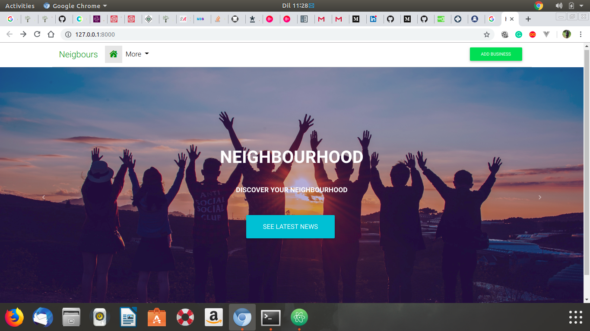
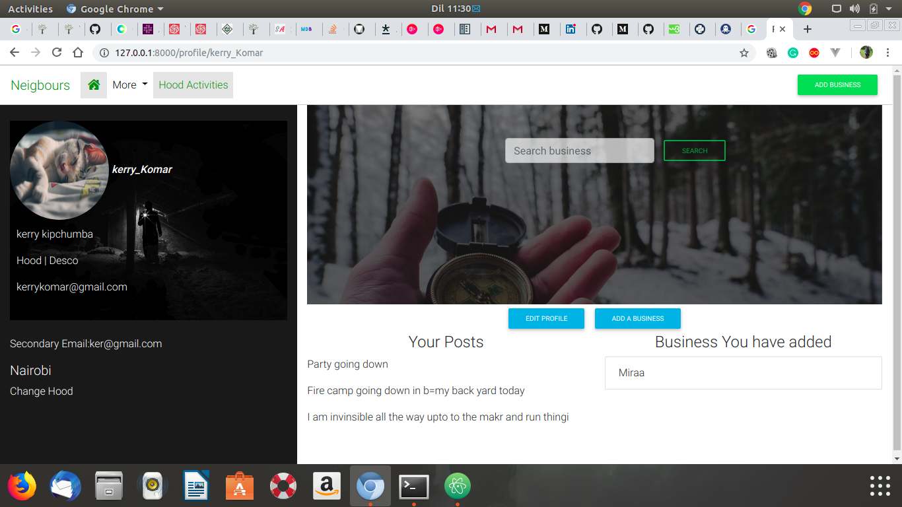
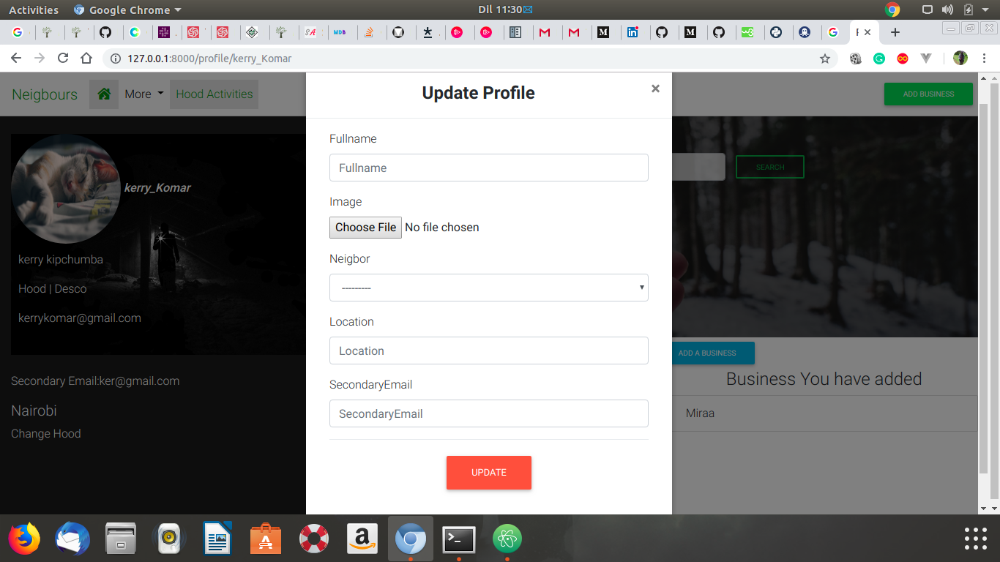
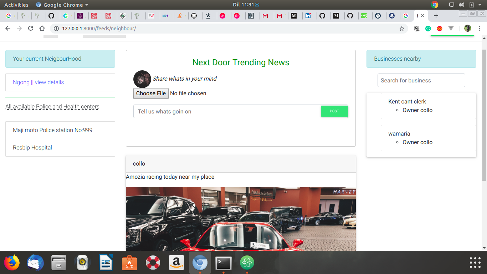

# NEIGHBOURHOOD

#### This is a Python web application using Django  framework and Postgresql,RESTful API,2019

#### By **KENNETH MUCHIRI**

## Description
Having to know everyone in your neighbourhood can be challenging, But their will be that feeling to know whats going on on your neighbourhood, maybe an event is going down on some next street or some bad activity just happened , Well how do you keep up with all these , Thus Creation of NextDoor App It allows users to be upto date to whatever activity that's going on in your neighbourhood

## Setup/Installation Requirements
* A PC mainly with an Operating system.
* Python3.6 or later is installed in your PC.
* Postgresql installed
* clone the directory into your local machine
* navigate to the cloned folder by `cd Neighbor-hood`
* Create a virtual environment
* run `source virtual/bin/activate`
* install Django `pip install django=1.11`
* pip install `requirements.txt`
* run `python3.6 manage.py runserver `
* The application should work
* for the test run `python manage.py test neighbours`

## Known Bugs
NO known bugs as at the moment please reach to us if you see any.
## Behavior Driven Development

| __Behavior__  | __Input example__ | __Output example__ |
| ------------- | ----------------- | ------------------ |
| The user should see the landing page on first sight | "https://www.next-door.com"   | Home  |
| The application should provide an option to register or login to the app | login/register | true  |
| The application should authenticate Users base on details the user provides   | password/username |  access or no access |
| The user should be redirected to home page once logged in | access | home page |
| The user should be able to update their Profile by adding desired location and neighbourhood | locations/hoos | one location and hood |
| The application should be able to restrict unauthorized users from accessing some parts of the application | view | true/false |
| The user should be able to update his/her profile any time | profile update | True |
| The user should be able to post any event in his/her neighbourhood | post stories | visible stories to all users in that neighbourhood |
| The user should be able to search available business around his her location  | search | results |
| The user should be able to logout at will | logout | True |

## Technologies Used
## main languages used are
* Python
* Material design
* WhiteNoise
* JavaScript
* CSS
* Django
* PostgreSQL Database

## Support and contact details
Email : kenmucciz8@gmail.com
### License
*License is under MIT 2019*
view Full License here [MIT](LICENSE)
Copyright (c) 2019 **Kenneth Muchiri**
This software is free to use and distribute, Therefore all rights and given to any user to modify and either use for Commercial purpose or local purpose.
